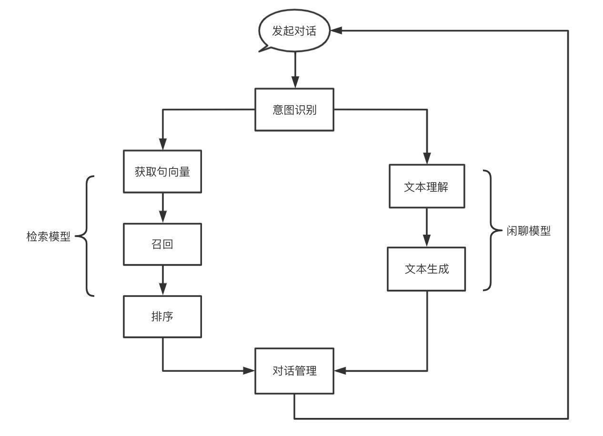
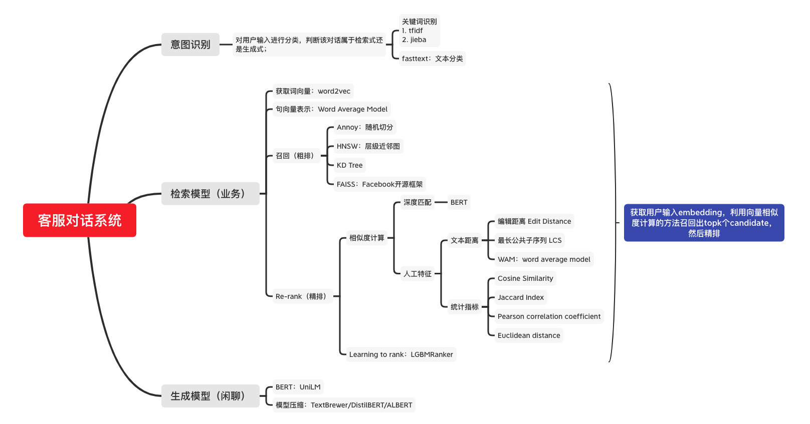
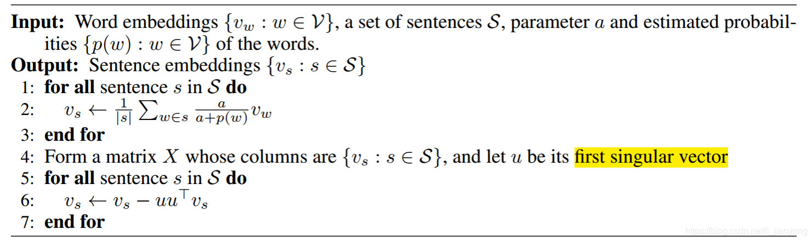
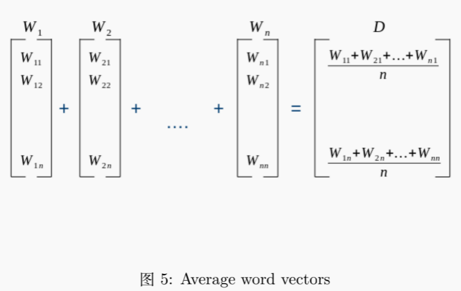

# 京东客服对话系统实战

[TOC]


## **项目介绍**

智能客服机器人已经成为了客服系统的重要组成部分，帮助人工客服提升工作效率，为企业降低人工成本。

## **整体框架**

项目的执行流程如下图所示，首先用户发起单次对话，经过意图识别模块，这里的意图识别只简单的实现了一个二分类，即对用户的输入进行文本分类，判断该对话是否与业务相关，如果相关，则转入检索式对话系统，否则进入闲聊系统。



项目所涉及到的所有技术如下图所示：



## **数据预处理**

### 训练数据

这里的训练数据来自于京东客服真实场景下的对话数据，部分对话数据如下：

* chat.txt，共20,562,086条(考虑到速度和时间，这里只取了100w)：

```
会话编号 顾客id sku 是否客服发送 是否转出 是否重复咨询 内容
000002d0fa6d23510c40200e45ce293c        USERID_10503190 0       0       0               这款电脑能用不
000002d0fa6d23510c40200e45ce293c        USERID_10503190 0       0       0               写的是车载
000002d0fa6d23510c40200e45ce293c        USERID_10503190 1       0       0               小妹正在火速为您查询，还请您稍等一下呢，谢谢#E-s[数字x]
000002d0fa6d23510c40200e45ce293c        USERID_10503190 1       0       0                 亲爱的  还辛苦您先稍等下的哈
000002d0fa6d23510c40200e45ce293c        USERID_10503190 1       0       0               这边咨询下下 供应商的哈
000002d0fa6d23510c40200e45ce293c        USERID_10503190 0       0       0               好的
000002d0fa6d23510c40200e45ce293c        USERID_10503190 1       0       0               #E-s[数字x]#E-s[数字x]
000002d0fa6d23510c40200e45ce293c        USERID_10503190 1       0       0                 亲爱的  感谢您的理解的哈
000002d0fa6d23510c40200e45ce293c        USERID_10503190 1       0       0               请问还有什么需要为您效劳的呢?#E-s[数字x]
000002d0fa6d23510c40200e45ce293c        USERID_10503190 0       0       0               没事
```

​	字段说明：

1. 是否客服发送：0:顾客，1:客服，根据此标识将对话组织成单轮对话
2. 会话编号：数据所属会话的唯一标识，根据此编号对对话数据进行聚合

* 开发集，1000条：

```
a_54    customer_aXY    2297112 0       我收到商品不知道怎么使用
a_54    customer_aXY    2297112 1       您好，京东客服4**号很高兴为您服务！<sep>您好，京东客服4**号很高兴为您服务！<sep>NULL
a_54    customer_aXY    2297112 0       我买的数据线充不进去电
a_54    customer_aXY    2297112 1       2297112 品胜（PISEN）苹果数据线 Xs Max/XR/X/8手机充电线 1.2米白色 适用于苹果5/6S/7/8Plus iPad Air/Pro !@@@!外观有破损吗<sep>您好，您收到商品是否有破损呢，使用的时候是否有什么提示呢<sep>NULL
a_54    customer_aXY    2297112 0       没有
a_54    customer_aXY    2297112 1        这边给您申请换货!@@@!您看好吗<sep>这样的话，这边为您申请一下换货您看可以么<sep>NULL
a_54    customer_aXY    2297112 0       好的
a_54    customer_aXY    2297112 0       我现在在学校里，地址有变
a_54    customer_aXY    2297112 1       可以改!@@@!提供一下地址<sep>好的，麻烦您提供一下地址这边为您更新哈<sep>NULL
a_54    customer_aXY    2297112 0       四川省***
```

* 测试集，1000条：

```
a_47    customer_9Ta    100000323579    0       怎么申请价保呢？
a_47    customer_9Ta    100000323579    1       您好，京东客服1**号很高兴为您服务！!@@@!有什么问题我可以帮您处理或解决呢？<sep>您好，京东客服1**号很高兴为您服务！!@@@!您看是商品降价的问题么？<sep>您好，京东客服很高兴为您服务！
a_47    customer_9Ta    100000323579    0       你好
a_47    customer_9Ta    100000323579    0       NULL
a_47    customer_9Ta    100000323579    0       要求补差价
a_47    customer_9Ta    100000323579    1       还请您稍等，正在为您查询~!@@@!  尼康（Nikon）D3500 18-55 入门VR防抖套机 单反数码照相机 女神/新手单反 轻巧便携!@@@!您好，请问是这个商品吗？<sep>稍等一下哦，我帮您看看!@@@!您看是这个订单么？订单号：***<sep>现在是商品有降价是吗
a_47    customer_9Ta    100000323579    0       是
a_47    customer_9Ta    100000323579    0       你看下我提交的订单
```

### **数据预处理**

执行`utils/preprocessing.py`进行数据预处理，生成三个csv文件：train.csv、dev.csv和test.csv。

* **数据清洗**，需要清洗的特殊字段有：

```python
def filter_content(sentence):
    """
    特殊字段有：
    1. #E-s[数字x] #E-2[数字x] 等一系列数字—— 表情
    2. [ORDERID_10187709] —— 订单号
    3. [数字x] —— 数字
    4. https://item.jd.com/5898522.html —— 网址
    5. [地址x] —— 地址
    6. [链接x] —— 链接
    7. [金额x] —— 金额
    8. [日期x] —— 日期
    9. [时间x] —— 时间
    10. [站点x] —— 站点
    11. [组织机构x] ——组织机构
    12. [电话x] —— 电话
    13. [姓名x] —— 人名
    对于表情，做法是直接删除。其他用希腊符号替换。
    """
    sep = Config.sep
    if isinstance(sentence, str):
        sentence = [sentence]
    sentence = sep.join(sentence)
    sentence = re.sub(
        r"#E\-[\w]*(抱拳|傲慢|得意|蛋糕|呕吐|闭嘴|礼物|yaoping|柠檬|流泪|怒火|撇嘴|太阳|咒骂|糗|猪猪|足球|磕头|大兵|电话|灯泡|飞鸟|奋斗|高兴|击打|饥饿|咖啡|口罩|骷髅|可乐|疯狂|白眼|阴险|叹气|奸笑|发呆|害羞|飞吻|怒火|悲伤|胜利|生病|弱|可怜|咖啡|酷酷|眩晕|流泪|发抖|难过|右哼哼|惊恐|悲伤|犯困|愤怒|凋谢|哈欠|拥抱|抓狂|鄙视|时间|啤酒|勾引|左哼哼|月亮|偷笑|震惊|惊讶|跳跳|瞌睡|可爱|衰样|好|憨笑|水果|色色|黑线|微笑|流汗|握手|心碎|问号|大哭|亲亲|抠鼻|拜拜|鬼脸|香吻|米饭|花朵|尴尬|擦汗|安慰|委屈|调皮|爱心|我一定尽力为您解答的哦|很棒|鼓掌)+",
        "α", sentence)
    sentence = re.sub(r"#E\-[\w]+\[数字x]", "α", sentence)
    sentence = re.sub(r"\[ORDERID_[\d]+]", "[订单x]", sentence)
    sentence = re.sub(r"\[数字x]", "γ", sentence)
    sentence = re.sub(r"\[链接x]", "ε", sentence)
    sentence = re.sub(r"\[表情]", "α", sentence)
    sentence = re.sub("<sep>", sep, sentence)
    sentence = re.sub("<SEP>", sep, sentence)
    sentence = re.sub(
        r"(http|ftp|https):\/\/[\w\-_]+(\.[\w\-_]+)+([\w\-\.,@?^=%&amp;:/~\+#]*[\w\-\@?^=%&amp;/~\+#])?",
        "ε", sentence)
    sentence = re.sub(r"(http|ftp|https):\/\/ε", "ε", sentence)
    sentence = re.sub(r"[\d]+.*[\d]+", "γ", sentence)
    sentence = re.sub(r"【收到不支持的消息类型，暂无法显示】", " ", sentence)

    sentence = re.sub(r"#E\-[s]*(ν|γ|π|ζ|ρ|α|ε)*", "α", sentence)
    sentence = re.sub("α", " ", sentence)
    sentence = re.sub("ε", "[链接x]", sentence)
    sentence = re.sub("γ", "[数字x]", sentence)

    return sentence
```

* **对话合并**：将原始数据组织成成问答pair，或者将一次会话内容合并一起

数据预处理前后：

**before**：

```
a_47	customer_9Ta	100000323579	0	怎么申请价保呢？
a_47	customer_9Ta	100000323579	1	您好，京东客服1**号很高兴为您服务！!@@@!有什么问题我可以帮您处理或解决呢？<sep>您好，京东客服1**号很高兴为您服务！!@@@!您看是商品降价的问题么？<sep>您好，京东客服很高兴为您服务！
a_47	customer_9Ta	100000323579	0	你好
a_47	customer_9Ta	100000323579	0	NULL
a_47	customer_9Ta	100000323579	0	要求补差价
a_47	customer_9Ta	100000323579	1	还请您稍等，正在为您查询~!@@@!	尼康（Nikon）D3500 18-55 入门VR防抖套机 单反数码照相机 女神/新手单反 轻巧便携!@@@!您好，请问是这个商品吗？<sep>稍等一下哦，我帮您看看!@@@!您看是这个订单么？订单号：***<sep>现在是商品有降价是吗
a_47	customer_9Ta	100000323579	0	是
a_47	customer_9Ta	100000323579	0	你看下我提交的订单
a_47	customer_9Ta	100000323579	0	才3099
a_47	customer_9Ta	100000323579	0	刚提交的
a_47	customer_9Ta	100000323579	0	8**
a_47	customer_9Ta	100000323579	0	8**
a_47	customer_9Ta	100000323579	1	稍等!@@@!帮您看看呢!@@@!#E-s01#E-s01#E-s01!@@@! 结果: 该商品符合价保规则，比价价保成功，应价保 [价保金额（单件）] * [价保商品数量] = 150.00 !@@@!您的价保已经为您提交申请，以后遇到降价也可以自行提交哦，这样会更快一点的呢，具体路径：电脑端：我的订单-左侧功能栏-客户服务-价格保护；手机端：我的-客户服务-价格保护<sep>NULL!@@@!好的，稍等这边为您申请一下就可以了哦<sep>NULL!@@@!好的，稍等一下，这边帮您申请看看
a_47	customer_9Ta	100000323579	0	ok
a_47	customer_9Ta	100000323579	1	很高兴遇到您这么善解人意的客户，请问还有其他还可以帮到您的吗？#E-s57#E-s57<sep>NULL<sep>NULL	
```

**after**：

```
session_id,custom,assistance
100000323579,怎么申请价保呢？,您好，京东客服[数字x]**号很高兴为您服务！!@@@!您看是商品降价的问题么？[SEP]您好，京东客服很高兴为您服务！
100000323579,你好[SEP]NULL[SEP]要求补差价,尼康（Nikon）D[数字x]入门VR防抖套机单反数码照相机女神/新手单反轻巧便携!@@@!您好，请问是这个商品吗？[SEP]稍等一下哦，我帮您看看!@@@!您看是这个订单么？订单号：***[SEP]现在是商品有降价是吗
100000323579,是[SEP]你看下我提交的订单[SEP]才[数字x]**,稍等!@@@!帮您看看呢!@@@! !@@@!您的价保已经为您提交申请，以后遇到降价也可以自行提交哦，这样会更快一点的呢，具体路径：电脑端：我的订单-左侧功能栏-客户服务-价格保护；手机端：我的-客户服务-价格保护[SEP]NULL!@@@!好的，稍等这边为您申请一下就可以了哦[SEP]NULL!@@@!好的，稍等一下，这边帮您申请看看
100000323579,ok,很高兴遇到您这么善解人意的客户，请问还有其他还可以帮到您的吗？ [SEP]NULL[SEP]NULL
```


## **意图识别**

执行`intention/business.py`中的`Intention`类实现意图识别分类模块，所使用的数据来源是对话数据中的用户侧数据。

补充：[搜索中的意图识别 - 知乎 (zhihu.com)](https://zhuanlan.zhihu.com/p/261367997)


* 传统的智能问答中的NLU意图识别流程：
  * 中文分词：`jieba.tokenizer`
  * 特征提取：`sklearn.feature_extraction.text.CountVectorizer`
  * 分类：`EmbeddingIntentClassifier`
* 意图识别的方法：
  * 基于词典和规则的方法
  * 基于ML和DL的方法：
    * FastText：非常快
    * TextCNN：快
    * rnn系列并不推荐，一个是耗时，另一方面query的内容很短并不适合抽取序列信息。
    * bert之类的大家伙，使用时需要谨慎，耗时虽然要考虑，但是性价比、提升空间之类的也要好好分析，fasttext效果很差，很多时候bert也不见得好到哪里去。
  * 多标签分类，然后加排序
  * 多个二分类级联，然后加排序


### fasttext：分本分类

* **step1: 原始数据预处理（关键词识别），并处理成fasttext 需要的数据格式。**

  1. 直接采用了来自京东业务的关键词词表ware.txt进行关键词匹配，判断咨询中是否包含业务关键词， 如果包含label为1， 否则为0；

  2. 使用`jieba.posseg`进行词性标注，找出名词词性补充关键词词表；

  3. **还可以采用的方案有：tfidf、TextRaner**

  4. fasttext格式：`"__label__" + label + "\t" + content + "\n"`，其中sequence以空格作为word之间的分隔符，具体说明见[Text classification · fastText](https://fasttext.cc/docs/en/supervised-tutorial.html#getting-and-preparing-the-data)

     ```
     __label__1	怎 么 申 请 价 保 呢
     __label__1	你 好 [ S E P ] N U L L [ S E P ] 要 求 补 差 价
     __label__1	是 [ S E P ] 你 看 下 我 提 交 的 订 单 [ S E P ] 才 [ 数 字 x ]
     __label__0	o k
     __label__1	那 我 还 需 要 去 申 请 保 价 吗
     __label__0	好 的 谢 谢 你
     __label__0	好
     __label__1	你 好 想 问 有 卖 鞋 垫 吗 [ S E P ] [ 链 接 x ]
     __label__0	好 的 谢 谢
     __label__0	没 有 了 谢 谢
     __label__1	可 以 换 同 价 的 其 他 尺 码 吗 [ S E P ] [ 链 接 x ]
     ```

* **step2: 构建意图识别模型：**

  使用fasttext构建文本分类模型，label为{0, 1}，这里掉的接口是Facebook开源的fasttext库

  fasttext文档：https://fasttext.cc/docs/en/supervised-tutorial.html

  ```python
  classifier = fasttext.train_supervised(model_train_file,
                                                 label="__label__",
                                                 dim=100,
                                                 epoch=20,
                                                 lr=0.5,
                                                 wordNgrams=2,
                                                 loss='softmax',
                                                 thread=5,
                                                 verbose=True)
  ```

* **step：保存模型**

  模型保存位置：`model/intention/fastext.bin`

  调用该模型即可快速对用户的输入进行意图识别分类，如：

  输入“你好想问有卖鞋垫吗[SEP][链接x]”或“我要申请价保”，fasttext均将其归类成了1，即与业务有关。

  ```
  INFO - 22:11:51: Predicting.
  INFO - 22:11:51: text: 你好想问有卖鞋垫吗[SEP][链接x]
  INFO - 22:11:51: clean text: 你 好 想 问 有 卖 鞋 垫 吗 [ S E P ] [ 链 接 x ]
  (('__label__1',), array([1.00001001]))
  INFO - 22:11:51: Predicting.
  INFO - 22:11:51: text: 我要申请价保
  INFO - 22:11:51: clean text: 我 要 申 请 价 保
  (('__label__1',), array([1.00001001]))
  INFO - 09:00:44: Testing trained model.
  INFO - 09:00:44: f1: 0.9654
  ```


## **检索召回**

在检索召回场景下，这里直接使用word2vec模型获取词向量，然后采用WAM(Word Average Model)提取句向量。

补充：

* **句向量的获取方式**：[自然语言处理中句向量获取方式的简要综述 - 知乎 (zhihu.com)](https://zhuanlan.zhihu.com/p/350957155)

  

  1. 通过词向量获取句向量：

     * 累加法

     * 平均法：word average model，先提取词向量，然后求平均

     * TF-IDF加权平均法

     * SIF嵌入法

       

  2. 通过模型直接获得句向量：

     * Bert [NLP-Interview-Notes/bertCode4_word2embedding.md at main · km1994/NLP-Interview-Notes (github.com)](https://github.com/km1994/NLP-Interview-Notes/blob/main/NLPinterview/PreTraining/bert/bertCode4_word2embedding.md)

       > BERT是N层 transformer构成的，每一层transformer的输出值，理论上来说都可以作为句向量。但真正进行使用，选取倒数第二层来作为句向量的效果是最好的，因为Bert的最后一层的值太接近于训练任务目标，Bert前面几层transformer的可能还未充分的学习到语义特征 ，因此选择Bert倒数第二层作为句向量是比较合适的。

     * Doc2Vec

* **检索召回评价指标**：

  * Precision

  * Recall

  * F1-score

  * MAP

    > MAP，全称Mean Average Precision(平均准确率)。MAP是为解决Precision、Recall、F-score的单点值局限性的，同时考虑检索效果的排名情况。计算如下：假设有两个主题，主题1有4个相关网页，主题2有5个相关网页。某系统对于主题1检索出4个相关网页，其rank分别为1,2,4,7；对于主题2检索出3个相关网页，其rank分别为1,3,5。对于主题1，平均准确率为(1/1+2/2+3/4+4/7) / 4 = 0.83。对于主题2，平均准确率为(1/1+2/3+3/5+0+0) / 5 = 2.45。则MAP=(0.83+0.45) / 2 = 0.64

### **word2vec：获取词向量**

* 注意：此处的embeddings以字为粒度，代码：`/Chinese-Dialogue-System/retrieval/word2vec.py`

  ```python
  		train['cut'] = train['clean'].apply(lambda x: x.split())
      unigram_sents = train['cut'].values
      phrase_model = Phrases(
          unigram_sents, min_count=5, progress_per=10000, delimiter=b' ')
      bigram = Phraser(phrase_model)
      logging.info("sentence: %s" % unigram_sents[0])
      logging.info("the bigram sentence: %s" % bigram[unigram_sents[0]])
      corpus = bigram[unigram_sents]
  
      cores = multiprocessing.cpu_count()
      w2v_model = Word2Vec(min_count=2,
                           window=2,
                           size=300,
                           sample=6e-5,
                           alpha=0.03,
                           min_alpha=0.0007,
                           negative=15,
                           workers=cores - 1,
                           iter=7)
      w2v_model.build_vocab(corpus)
      w2v_model.train(corpus, epochs=15, total_examples=w2v_model.corpus_count)
      if not os.path.exists(os.path.dirname(to_file)):
          os.makedirs(os.path.dirname(to_file))
      w2v_model.wv.save(to_file)
  ```

### **WAM：提取句向量**

为了通过计算距离来实现近似搜索，我们需要将一个句子或者一篇文档表示为一个向量，这种方式叫做 Sentence Embedding 或者 Doc Embedding。



```python
def wam(sentence, w2v_model):
    '''
    @description: 通过word average model 生成句向量
    @param {type}
    sentence: 以空格分割的句子
    w2v_model: word2vec模型
    @return: The sentence vector.
    '''
    sentence = sentence.split()
    sen_len = len(sentence)
    sen_vec = np.zeros(w2v_model.vector_size).astype("float32")
    for word in sentence:
        if word in w2v_model:
            wv = w2v_model.wv[word]
            sen_vec += wv
        else:
            sen_vec += np.random.randn(300).astype("float32")

    return sen_vec / sen_len
```

### **HNSW**：层级可导航小世界

 [NLP之对话系统及信息检索技术.md](NLP之对话系统及信息检索技术.md) 

这里直接使用了Facebook 开源的Faiss框架实现了HNSW检索召回，运行：`/Chinese-Dialogue-System/retrieval/hnsw_faiss.py`

### **Faiss**：Facebook开源框架

[Faiss: A library for efficient similarity search - Facebook Engineering (fb.com)](https://engineering.fb.com/2017/03/29/data-infrastructure/faiss-a-library-for-efficient-similarity-search/)

这里介绍了如何选择构建索引的方式：[Guidelines to choose an index · facebookresearch/faiss Wiki (github.com)](https://github.com/facebookresearch/faiss/wiki/Guidelines-to-choose-an-index)

中文：[Faiss Indexs 的进一步了解 (waltyou.github.io)](https://waltyou.github.io/Faiss-Indexs/)

这里采用的是**IndexHNSWFlat**。

* 代码：

  ```python
  	def build_hnsw(self, to_file, ef=2000, m=64):
          '''
          @description: 训练hnsw模型
          @param {type}
          to_file： 模型保存目录
          ef：
          m：
          @return:
          '''
          logging.info('Building hnsw index.')
          # nb = len(self.data['assistance_vec'])
          vecs = np.stack(
              self.data['custom_vec'].values).reshape(-1, 300).astype("float32")
          # vecs = np.zeros(shape=(nb, 300), dtype=np.float32)
          # for i, vec in enumerate(self.data['assistance_vec'].values):
          #     vecs[i, :] = vec
          dim = self.w2v_model.vector_size
          index = faiss.IndexHNSWFlat(dim, m)
          index.hnsw.efConstruction = ef
          res = faiss.StandardGpuResources()  # use a single GPU
          faiss.index_cpu_to_gpu(res, 0, index)  # make it a GPU index
          index.verbose = True
  
          logging.info('xb: {}'.format(vecs.shape))
          logging.info('dtype: {}'.format(vecs.dtype))
          index.add(vecs)
  
          logging.info("total: %s" % str(index.ntotal))
  
          assert to_file is not None
          logging.info('Saving hnsw index to %s' % to_file)
          if not os.path.exists(os.path.dirname(to_file)):
              os.mkdir(os.path.dirname(to_file))
          faiss.write_index(index, to_file)
  
          self.evaluate(index, vecs[:10000])
  
          return index
  ```

* 结果：

  对于输入的text，此处示例为“我要转人工”，我们可以召回出topk个相关的咨询，及其对应的assistance。

  ```
       index custom                                         assistance  q_distance
  0  1302621  我要转人工  您好，京东客服很高兴为您服务~  [SEP]请问您是咨询之前的问题还是有其他的问题需要处理呢?           0.0
  1   869861  我要转人工                                  有什么问题我可以帮您处理或解决呢?         0.0
  2  3950084  我要转人工                                  有什么问题我可以帮您处理或解决呢?         0.0
  3  3334178  我要转人工                                            下午好亲爱哒          0.0
  4  5348272  我要转人工                                       麻烦您提供下订单号可以么         0.0
  5   353910  我要转人工                           您好，请问有什么可以帮您的吗?妹子尽力为您解答哦         0.0
  6  3062879  我要转人工                                  有什么问题我可以帮您处理或解决呢?         0.0
  7  3312576  我要转人工           亲 ，请问有什么可以帮您? [SEP]亲，小点心在的哦，很高兴为您服务哦~~~          0.0
  8  3007053  我要转人工                                      您好，请问有什么可以帮您?         0.0
  9  2305853  我要转人工                          请问您是咨询之前的问题还是有其他的问题需要处理呢?         0.0
  INFO - 17:47:09: Evaluating.
  ```

* evaluate：这里直接使用数据的前1w条数据进行召回，检查召回的top1是不是自身，计算recall。

  ```python
  	def evaluate(self, index, vecs):
          '''
          @description: 评估模型。
          @param {type} vecs: The vectors to evaluate.
          @return {type} None
          '''
          logging.info('Evaluating.')
  
          nq, d = vecs.shape
          t0 = time.time()
          D, I = index.search(vecs, 1)
          t1 = time.time()
  
          missing_rate = (I == -1).sum() / float(nq)
          recall_at_1 = (I == np.arange(nq)).sum() / float(nq)
          logging.info('\t %7.3f ms per query, R@1 %.4f, missing_rate %.4f' %
                       ((t1 - t0) * 1000.0 / nq, recall_at_1, missing_rate))
  ```

* HNSW参数选取及影响：

  [广告行业中那些趣事系列38：广告搜索业务中海量高维数据集检索利器Faiss - 知乎 (zhihu.com)](https://zhuanlan.zhihu.com/p/398021738)

  数据集大小：150w，向量维度：300

  | 方法          | M    | efConstruction | efSearch | build time | query time | recall |
  | ------------- | ---- | -------------- | -------- | ---------- | ---------- | ------ |
  | IndexHNSWFlat | 16   | 40             | 64       | 6min       | 0.020ms    | 0.4120 |
  | IndexHNSWFlat | 16   | 1000           | 64       | 40min      | 0.157ms    | 0.5966 |
  | IndexHNSWFlat | 64   | 200            | 64       | 30min      | 0.219ms    | 0.6049 |
  | IndexHNSWFlat | 64   | 1000           | 64       | 230min     | 0.237ms    | 0.6062 |
  | IndexFlatL2   | -    | -              | -        | 0.7s       | 56.987ms   | 0.9499 |
  | IndexIVFFlat  | -    | -              | -        | 11s        | 2.804ms    | 1.0000 |
  | IndexIVFPQ    | -    | -              | -        | 64s        | 0.085ms    | 1.0000 |

## **精排**

在对每一条query召回topk个candidates之后，我们需要对每一个candidate进行打分，实现精排，这里有几种方案：

* 无监督：语义相似度模型：Bert_flow，Sentence_Bert，Bert_whitening，SimBert

* 有监督：排序模型
  * [平安智能问答系统 ](https://mp.weixin.qq.com/s/R7TXWjeYUNPmLG0DVGcpJA)：pairwise，输入样本是<question1, question2>的pair对
    * 语义向量，这个可以来自于各种预训练语言模型。
    * 语义向量计算后得到的相似度矩阵。
    * 问答对的共现情况（交集个数、重要度、占比等），如TF-IDF、BM25、编辑距离，属于文本层面的匹配。

  

  * [大众点评搜索基于知识图谱的深度学习排序实践 (qq.com)](https://mp.weixin.qq.com/s?__biz=MjM5NjQ5MTI5OA==&mid=2651750220&idx=1&sn=42df36757a7007808c56b53ee6832713&chksm=bd12a6018a652f17de2f66e28ba203bde1e8ae22155687fd3abe73b0336900a855c057e6ad38&mpshare=1&scene=1&srcid=0117dRsxGP0zSDCmQ4pTmBDF&pass_ticket=yoIK672aXk4WPiJRK3zkCxK5C5wwnua1%2B%2F115s%2FKJyXjdHQlvctIkGZpDsP%2FPVPZ#rd)

    * 适用于搜索场景的深度学习Listwise排序算法——LambdaDNN
    * 几种机器学习方法：

    > - LR可以视作单层单节点的线性网络结构。模型优点是可解释性强。通常而言，良好的解释性是工业界应用实践比较注重的一个指标，它意味着更好的可控性，同时也能指导工程师去分析问题优化模型。但是LR需要依赖大量的人工特征挖掘投入，有限的特征组合自然无法提供较强的表达能力。
    > - FM可以看做是在LR的基础上增加了一部分二阶交叉项。引入自动的交叉特征有助于减少人工挖掘的投入，同时增加模型的非线性，捕捉更多信息。FM能够自动学习两两特征间的关系，但更高量级的特征交叉仍然无法满足。
    > - GBDT是一个Boosting的模型，通过组合多个弱模型逐步拟合残差得到一个强模型。树模型具有天然的优势，能够很好的挖掘组合高阶统计特征，兼具较优的可解释性。GBDT的主要缺陷是依赖连续型的统计特征，对于高维度稀疏特征、时间序列特征不能很好的处理。


项目中采用了LTR中的pointwoise方式进行排序，用到的模型是LGBMRanker，对每一个query与candidate进行特征提取，然后计算score。所提取的特征包含人工定义特征和深度匹配特征。


### 数据

数据集在ranking_datasets.zip中，其中包含三个文件，数据集是分别是蚂蚁金服提供的花呗客服数据和微众银行提供的微粒贷客服数据，数据都是问题相似度的标注数据，分别包含两个问题，以及表示他们是否相关的标签（0或1）。利用这些数据集我们可以构建一个pointwise的L2R数据集来训练我们的L2R模型（也可以采用负采样的方式来构建pairwise和listwise的数据集）。数据集的描述可查看以下链接：

*  [ATEC学习赛：NLP之问题相似度计算](https://dc.cloud.alipay.com/index#/topic/intro?id=8)

> 问题相似度计算，即给定客服里用户描述的两句话，用算法来判断是否表示了相同的语义。

> [数据集](https://dc.cloud.alipay.com/index#/topic/data?id=8)未经过脱敏处理 示例：
>
> 1. “花呗如何还款” --“花呗怎么还款”：同义问句
> 2. “花呗如何还款” -- “我怎么还我的花被呢”：同义问句
> 3. “花呗分期后逾期了如何还款”-- “花呗分期后逾期了哪里还款”：非同义问句 对于例子a，比较简单的方法就可以判定同义；对于例子b，包含了错别字、同义词、词序变换等问题，两个句子乍一看并不类似，想正确判断比较有挑战；对于例子c，两句> 话很类似，仅仅有一处细微的差别 “如何”和“哪里”，就导致语义不一致。"""

* [CCKS 2018 微众银行智能客服问句匹配大赛](https://biendata.com/competition/CCKS2018_3/leaderboard/)

> 与基于Quora的的的语义等价判别相同，本次评测任务的主要目标是针对中文的真实客服语料，进行问句意图匹配。集给定两个语句，要求判定两者意图是否相同或者相近。所有语料来自原始的银行领域智能客服日志，并经过了筛选和人工的意图匹配标注。

> [数据集](https://biendata.com/competition/CCKS2018_3/data/)经过脱敏处理 输入：一般几天能通过审核\ t一般审核通过要多久 输出：1

数据集需要处理成三个文件train.tsv, dev.tsv和test.tsv，放在data/ranking目录。

### 特征提取

各种人工特征及特征定义如下：

* [Edit distance - Wikipedia](https://en.wikipedia.org/wiki/Edit_distance)
* [Longest common subsequence problem - Wikipedia](https://en.wikipedia.org/wiki/Longest_common_subsequence_problem#:~:text=The_longest_common_subsequence_(LCS,(often_just_two_sequences).)
* [Euclidean distance - Wikipedia](https://en.wikipedia.org/wiki/Euclidean_distance#:~:text=In_mathematics,_the_Euclidean_distance,metric_as_the_Pythagorean_metric.)
* [Cosine similarity - Wikipedia](https://en.wikipedia.org/wiki/Cosine_similarity)
* [Jaccard index - Wikipedia](https://en.wikipedia.org/wiki/Jaccard_index)
* [Pearson correlation coefficient - Wikipedia](https://en.wikipedia.org/wiki/Pearson_correlation_coefficient)

### 人工特征

* BM25
* [TF-IDF](https://radimrehurek.com/gensim/models/tfidfmodel.html#module-gensim.models.tfidfmodel)
* [word2vec](https://radimrehurek.com/gensim/auto_examples/tutorials/run_word2vec.html#word2vec-model)
* [FastText](https://radimrehurek.com/gensim/auto_examples/tutorials/run_fasttext.html#fasttext-model)

Step1: 首先在训练数据集上训练BM25、tf-idf模型、word2vec模型和fasttext模型，运行代码：

* `/Chinese-Dialogue-System/ranking/bm25.py`
* `/Chinese-Dialogue-System/ranking/train_lm.py`

Step2: 构建各种相似度特征，详⻅`/Chinese-Dialogue-System/utils/similarity.py`的generate_all函数。

### 深度匹配：BERT

下载预训练模型：

* [bert-base-chinese · Hugging Face](https://huggingface.co/bert-base-chinese)
* [RoBerta](https://drive.google.com/open?id=1-2vEZfIFCdM1-vJ3GD6DlSyKT4eVXMKq)

采用预训练模型获取句子的表示，并计算两个句子的score。这里采用的是微调⼀个BERT模型对输⼊的两个问题做序列相似度的匹配，得到⼀个相似度的分数。

运⾏ `/Chinese-Dialogue-System/ranking/train.py` 来训练深度匹配模型。这里使用的是`BertForNextSentencePrediction`。模型参见：`/Chinese-Dialogue-System/ranking/model.py`

结果(batch_size: 32, learning_rate:0.00002)：

|           model           | accuracy |
| :-----------------------: | :------: |
|     bert-base-chinese     | 89.1904  |
| chinese_roberta_wwm_large | 89.0545  |


### 排序模型：Lightgbm

运行`/Chinese-Dialogue-System/ranking/ranker.py`实现精排。这里用的接口是LGBMRanker，具体使用参见[lightgbm.LGBMRanker — LightGBM 3.2.1.99 documentation](https://lightgbm.readthedocs.io/en/latest/pythonapi/lightgbm.LGBMRanker.html)。[这篇博客](https://tamaracucumides.medium.com/learning-to-rank-with-lightgbm-code-example-in-python-843bd7b44574)介绍了LGBMRanker的实现。

* 首先利用先前训练好的BM25、tf-idf模型、word2vec模型和fasttext模型提取人工特征；

* 利用BERT提取深度匹配特征；

* 组合特征，训练LGBMRanker，为了进行排名，我们可以使用 LambdaRank 作为目标函数。 LambdaRank 已被证明在优化排序函数（如 nDCG）方面非常有效。

  > Normalized discounted cummulative gain (nDCG) is a very popular ranking metric and it measures the *gain* of a document regarding in what’s it’s position: a relevant document placed within the first positions (at the top) will have a greater gain than a relevant document placed at the bottom.

* 输入两个question计算得分；

部分代码：

```python
import lightgbm as lgb
gbm = lgb.LGBMRanker()
from sklearn.model_selection import train_test_split

X_train, X_val, y_train, y_val = train_test_split(X_train, y_train, test_size=0.2, random_state=1)

query_train = [X_train.shape[0]]
query_val = [X_val.shape[0]]

gbm.fit(X_train, y_train, group=query_train,
        eval_set=[(X_val, y_val)], eval_group=[query_val],
        eval_at=[5, 10, 20], early_stopping_rounds=50)

test_pred = gbm.predict(X_test)

X_test["predicted_ranking"] = test_pred
X_test.sort_values("predicted_ranking", ascending=False)
```

> 1. X_train, y_train, q_train : This is the data and the labels of the training set and the size of this group (as I only have one group, it’s size is the size of the entire data)
> 2. X_val, y_val, q_val: Same but with the validation set.
> 3. eval_at : This parameters are the k I’ll use to evaluate nDCG@k over the validation set
> 4. early_stopping_rounds : Parameter for early stopping so your model doesn’t overfit


## 整合

运行`/Chinese-Dialogue-System/ranking/task.py`，整合意图识别和召回，流程如下：


这里使用第一步数据清洗得到的dev.csv和test.csv，对于每一个query，取top5的结果，召回的结果保存在result/retrieved.csv；对于top5 的每一个candidate利用L2R计算得分，结果保存在result/ranked.csv。

## **闲聊式对话系统**

### **基于BERT的对话生成模型**

#### 数据集概述

在闲聊式对话系统模块使用的训练数据集来源于[LCCC(Large-scale Cleaned Chinese Conversation)](https://github.com/sjyttkl/GPT-Chinese)，该数据集已经经过一套严格的数据过滤流程来确保该数据集中对话数据的质量。 这一数据过滤流程中包括一系列手工规则以及若干基于机器学习算法所构建的分类器。 我们所过滤掉的噪声包括：脏字脏词、特殊字符、颜表情、语法不通的语句、上下文不相关的对话等。数据统计描述：

| [LCCC-base](https://cloud.tsinghua.edu.cn/f/f131a4d259184566a29c/) | 单轮对话   | 多轮对话    |
| ------------------------------------------------------------ | ---------- | ----------- |
| 总对话轮次                                                   | 3,354,382  | 3,466,607   |
| 总对话语句                                                   | 6,708,554  | 13,365,268  |
| 总字符数                                                     | 68,559,727 | 163,690,614 |
| 词表大小                                                     | 372,063    | 666,931     |
| 对话语句的评价词数                                           | 6.79       | 8.32        |
| 每轮对话的平均语句数                                         | 2          | 3.86        |

#### 处理数据

处理代码：`/Chinese-Dialogue-System/generative/data.py`

数据集处理成三个文件train.tsv, dev.tsv和test.tsv，放在data/generative目录下，数据集每一行为一组对话，对话之间用\t分隔。

#### BERT fine-tuning

BERT模型是基于Transformer的Encoder的双向模型，而对话生成需要一个单向的decoder。一般要利用BERT做NLG的任务需要再结合一个decoder（比如加多一个Transformer的decoder或者加多一个GPT），而我们这次要用一种更为方便的形式——	UniLM(论文：[[1905.03197\] Unified Language Model Pre-training for Natural Language Understanding and Generation (arxiv.org)](https://arxiv.org/abs/1905.03197)。

* 训练：`/Chinese-Dialogue-System/generative/train.py`
* 预测：`/Chinese-Dialogue-System/generative/predict.py`


[无监督语义相似度哪家强？我们做了个比较全面的评测 - 科学空间|Scientific Spaces (kexue.fm)](https://kexue.fm/archives/8321)

**小布助手对话短文本语义匹配**:[nilboy/gaic_track3_pair_sim: 全球人工智能技术创新大赛-赛道三-冠军方案 (github.com)](https://github.com/nilboy/gaic_track3_pair_sim)


